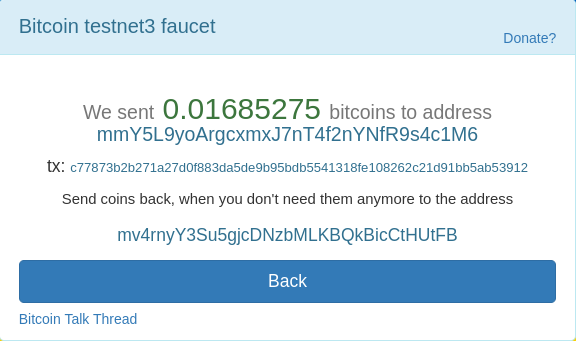

Private key: cTnMByebAjVc8TjtQfaAtZGcm3eAL95DfhALtUXk6F58y6dpgy7N
Address: mzLaAohp6ihFnuwQdQFFnm5zZ8jgh4UokJ
Tx: 2766304925bd59fde20216c5836628ef70c36bccb5699b855732f3d0157e93a6

split 0.015BTC into 10 outputs
bitcoin_split_TX: cc8fb122460f9f4cd88cd4f3b5f149c07421da36835e55dea30e8162b1e68be3
bitcoin_pay_TX: 67c2f5642a9fe2c8cd0e887e5ab474174019fe914af274e17e8e64f65ca26260

### The second request

| PrivateKey                                           | Address                            |
| ---------------------------------------------------- | ---------------------------------- |
| cRMf4HHQM1j3yVn93u9W5zoLKgt6SKS8MDqnFE5HJHhxLKP6PpXv | mmY5L9yoArgcxmxJ7nT4f2nYNfR9s4c1M6 |

transaction id: c77873b2b271a27d0f883da5de9b95bdb5541318fe108262c21d91bb5ab53912
