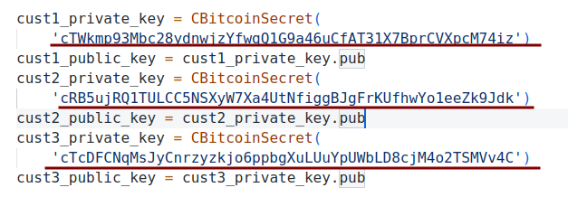
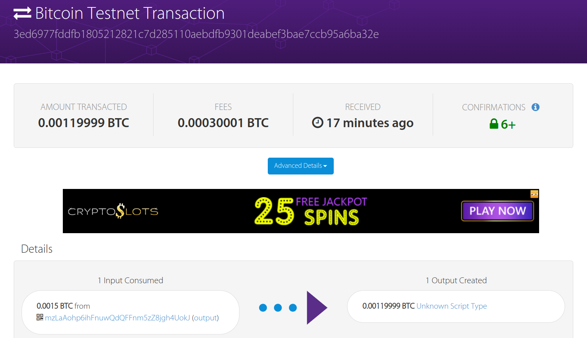

### ex2a.py
- 使用keygen生成3个私钥，作为3个客户
```
Private key: cTWkmp93Mbc28ydnwjzYfwgQ1G9a46uCfAT31X7BprCVXpcM74iz
Address: mrgkY1uyYdpJdvVuyVL6Wjt667dKNgsMvM

Private key: cRB5ujRQ1TULCC5NSXyW7Xa4UtNfiggBJgFrKUfhwYo1eeZk9Jdk
Address: mxgascCAefUmniA9rcJV88t5mKjMqW4nCX

Private key: cTcDFCNqMsJyCnrzyzkjo6ppbgXuLUuYpUWbLD8cjM4o2TSMVv4C
Address: mnBZhgatN9MczWW72dEkCHj5JFhgrwww5i
```

- 关键代码修改及注释为：

  - 输入三个客户的私钥

  

  - 加密脚本公钥和解密脚本公钥编写

    脚本的解密需要银行和任意一名客户的验证通过才能继续。

    首先将`OP_0`和银行以及三个客户入栈，执行`OP_CHECKEMULTISIG`对多个签名进行检查，直到没有剩余的公钥或者没有对应的签名，前者返回真，后者返回假并使事务无效。若返回真，继续执行`OP_VERIFY`，判断栈顶是否为1，此时栈顶为之前返回的1，则清空栈。

    > 这里0入栈是因为CHECKMULTISIG之后会多弹出一个元素，因此这里随意入栈一个元素均可

    继续对银行进行检查，将银行地址入栈，执行`OP_CHECKSIG`。成功则返回真。

    

  - 修改加密货币的相关参数

    

    分币后一份为0.0015，这里对第四份加密，并以0.0003为花费。

- 执行结果为：

```json
201 Created
{
  "tx": {
    "block_height": -1,
    "block_index": -1,
    "hash": "3ed6977fddfb1805212821c7d285110aebdfb9301deabef3bae7ccb95a6ba32e",
    "addresses": [
      "mzLaAohp6ihFnuwQdQFFnm5zZ8jgh4UokJ"
    ],
    "total": 119999,
    "fees": 30001,
    "size": 340,
    "vsize": 340,
    "preference": "medium",
    "relayed_by": "2001:250:401:6576:132b:9d8a:c663:5b4d",
    "received": "2022-10-18T04:04:06.566151Z",
    "ver": 1,
    "double_spend": false,
    "vin_sz": 1,
    "vout_sz": 1,
    "confirmations": 0,
    "inputs": [
      {
        "prev_hash": "cc8fb122460f9f4cd88cd4f3b5f149c07421da36835e55dea30e8162b1e68be3",
        "output_index": 4,
        "script": "47304402204b0b0d5cf859ec8c60779ae9d310f61c7e38d51e1fcabcbaef576d881ce413940220318abfdca6983666033be2ab808198344c2cb7a50d339108efbea390113be193012102db5f0ae1ef53d76bd78a4254ae87cf293175c197bf6270744b7a8e1fa7966804",
        "output_value": 150000,
        "sequence": 4294967295,
        "addresses": [
          "mzLaAohp6ihFnuwQdQFFnm5zZ8jgh4UokJ"
        ],
        "script_type": "pay-to-pubkey-hash",
        "age": 2349299
      }
    ],
    "outputs": [
      {
        "value": 119999,
        "script": "002102db5f0ae1ef53d76bd78a4254ae87cf293175c197bf6270744b7a8e1fa79668042102057cd667d3e2c481687ef3abc347895c1f3763c53f282a254a1885063ae8b5e021034b0ff4bf574b90816fcda87daa4eaa2c295301fbbc3e9135c5e6e89326612df321021d12629a2fb116591bafb1256a73119f4705aa5c1f30505ff17eaa2847c5b7d354af2102db5f0ae1ef53d76bd78a4254ae87cf293175c197bf6270744b7a8e1fa7966804ac",
        "addresses": null,
        "script_type": "unknown"
      }
    ]
  }
}
```

- 该交易的验证情况



### ex2b.py

- 修改解密脚本

  依据之前加密的顺序，修改脚本如下。先验证客户一和银行的地址，再验证银行的地址。

  
  
  修改取回量，其余作为花费。最终由`faucet`赎回。
  
  


- 运行结果

```json
201 Created
{
  "tx": {
    "block_height": -1,
    "block_index": -1,
    "hash": "372697da745e6fc3b5d34bd951a90c4dcd92c00e6a3a64728c37f5752f4c9c0c",
    "addresses": [
      "mv4rnyY3Su5gjcDNzbMLKBQkBicCtHUtFB"
    ],
    "total": 10000,
    "fees": 109999,
    "size": 303,
    "vsize": 303,
    "preference": "high",
    "relayed_by": "2001:250:401:6576:132b:9d8a:c663:5b4d",
    "received": "2022-10-18T04:31:57.18363448Z",
    "ver": 1,
    "double_spend": false,
    "vin_sz": 1,
    "vout_sz": 1,
    "confirmations": 0,
    "inputs": [
      {
        "prev_hash": "3ed6977fddfb1805212821c7d285110aebdfb9301deabef3bae7ccb95a6ba32e",
        "output_index": 0,
        "script": "47304402202ff4d33d92bfc98052da01a20e87bc570d35581f67aa46ebe211e67a0f9897ef022078c461b6586081931242bf822019fec94021bd997c05b816cd50f7e390baa610010047304402202ff4d33d92bfc98052da01a20e87bc570d35581f67aa46ebe211e67a0f9897ef022078c461b6586081931242bf822019fec94021bd997c05b816cd50f7e390baa61001483045022100d436d8270b3f3defd38f60a2a14fbc0028e7e9ae8a876c7f1607c452f04b1716022040184f3c4106fed07942a9252ac359b4f7c7fc1bce5ea12133678119adee9ea801",
        "output_value": 119999,
        "sequence": 4294967295,
        "script_type": "unknown",
        "age": 2377027
      }
    ],
    "outputs": [
      {
        "value": 10000,
        "script": "76a9149f9a7abd600c0caa03983a77c8c3df8e062cb2fa88ac",
        "addresses": [
          "mv4rnyY3Su5gjcDNzbMLKBQkBicCtHUtFB"
        ],
        "script_type": "pay-to-pubkey-hash"
      }
    ]
  }
}
```

- 网站截图

