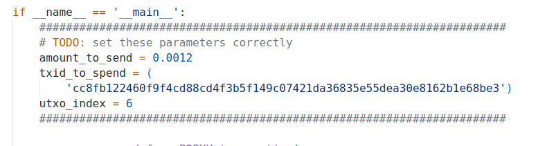
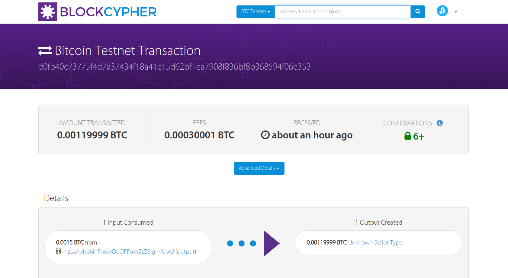
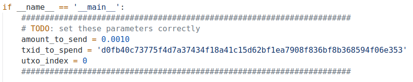
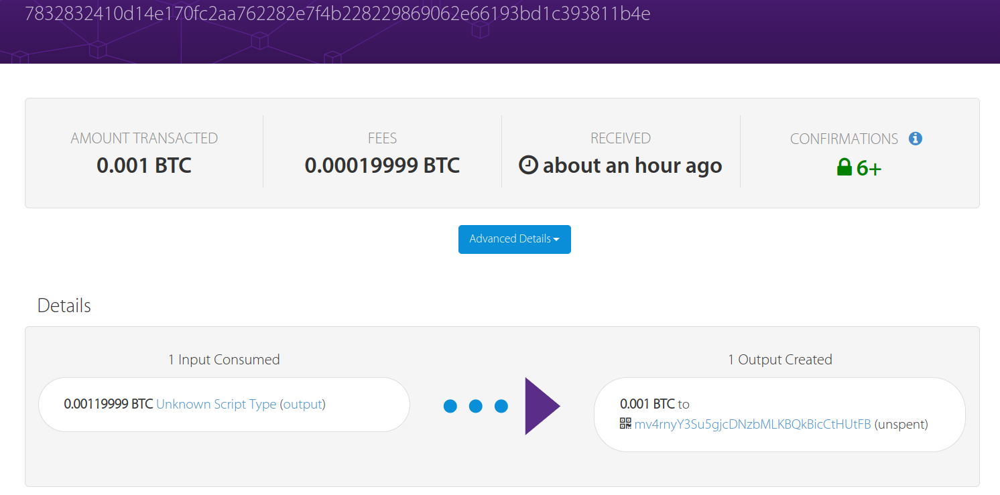

## Lab2

郭坤昌 2012522

### ex2a.py

- 使用keygen生成3个私钥，作为3个客户
```
Private key: cTWkmp93Mbc28ydnwjzYfwgQ1G9a46uCfAT31X7BprCVXpcM74iz
Address: mrgkY1uyYdpJdvVuyVL6Wjt667dKNgsMvM

Private key: cRB5ujRQ1TULCC5NSXyW7Xa4UtNfiggBJgFrKUfhwYo1eeZk9Jdk
Address: mxgascCAefUmniA9rcJV88t5mKjMqW4nCX

Private key: cTcDFCNqMsJyCnrzyzkjo6ppbgXuLUuYpUWbLD8cjM4o2TSMVv4C
Address: mnBZhgatN9MczWW72dEkCHj5JFhgrwww5i
```

- 输入三个客户的私钥


- 加锁脚本编写

  解锁需要两次验证，一是验证银行的公钥，二是验证四方交易其中的两方，因此设定如下的加锁脚本：

  `ex2a_txout_scriptPubKey = [OP_2, my_public_key, cust1_public_key, cust2_public_key, cust3_public_key, OP_4, OP_CHECKMULTISIGVERIFY, my_public_key, OP_CHECKSIG]*;*`

  开始的`OP_2`表示需要验证四个公钥中的两个，`OP_4`表示四个公钥，最后`OP_CHECKMULtISIGVERIGY`表示多方验证，验证结束后若验证成功，则栈顶为真，调用`OP_VERIFY`将栈顶的`1`清空。接下来验证银行自身的公钥，使用`OP_CHECKSIG`进行验证，验证正确则返回真。

- 修改加锁的相关参数

  

- 执行结果为：

```json
201 Created
{
  "tx": {
    "block_height": -1,
    "block_index": -1,
    "hash": "84b8b0c4e7a61401a3a271c9d3f84a3a34f4fd56864127291ad32985a99e8937",
    "addresses": [
      "mzLaAohp6ihFnuwQdQFFnm5zZ8jgh4UokJ"
    ],
    "total": 119999,
    "fees": 30001,
    "size": 340,
    "vsize": 340,
    "preference": "medium",
    "relayed_by": "2001:250:401:6561:47c2:d4cf:ce28:71be",
    "received": "2022-10-29T14:40:39.616307167Z",
    "ver": 1,
    "double_spend": false,
    "vin_sz": 1,
    "vout_sz": 1,
    "confirmations": 0,
    "inputs": [
      {
        "prev_hash": "cc8fb122460f9f4cd88cd4f3b5f149c07421da36835e55dea30e8162b1e68be3",
        "output_index": 5,
        "script": "47304402204cb3243d62054d28d8a0efd6909ed398b2cb02574c3178b4ca8eedb4f113e15602202ef3688a1df656972f06a3842fefc9e9f90721d58f439ded3d592cc57f56723e012102db5f0ae1ef53d76bd78a4254ae87cf293175c197bf6270744b7a8e1fa7966804",
        "output_value": 150000,
        "sequence": 4294967295,
        "addresses": [
          "mzLaAohp6ihFnuwQdQFFnm5zZ8jgh4UokJ"
        ],
        "script_type": "pay-to-pubkey-hash",
        "age": 2349299
      }
    ],
    "outputs": [
      {
        "value": 119999,
        "script": "002102db5f0ae1ef53d76bd78a4254ae87cf293175c197bf6270744b7a8e1fa79668042102057cd667d3e2c481687ef3abc347895c1f3763c53f282a254a1885063ae8b5e021034b0ff4bf574b90816fcda87daa4eaa2c295301fbbc3e9135c5e6e89326612df321021d12629a2fb116591bafb1256a73119f4705aa5c1f30505ff17eaa2847c5b7d354af2102db5f0ae1ef53d76bd78a4254ae87cf293175c197bf6270744b7a8e1fa7966804ac",
        "addresses": null,
        "script_type": "unknown"
      }
    ]
  }
}
```

- 交易情况为：



### ex2b.py

- 修改解锁脚本如下：

  `bank_sig, OP_0, cust1_sig, cust2_sig`

  这里对应先将解锁脚本中的元素入栈，在调用`OP_CHECKMULTISIGVERIFY`之后，对客户1和客户2进行验证，由于该脚本固有的bug，需要额外增加一个用于弹出的冗余元素，这里添加`OP_0`。最终的`bank_sig`对应加锁脚本中对公钥的验证。

- 修改赎回的相关参数




- 运行结果

```json
201 Created
{
  "tx": {
    "block_height": -1,
    "block_index": -1,
    "hash": "7832832410d14e170fc2aa762282e7f4b228229869062e66193bd1c393811b4e",
    "addresses": [
      "mv4rnyY3Su5gjcDNzbMLKBQkBicCtHUtFB"
    ],
    "total": 100000,
    "fees": 19999,
    "size": 304,
    "vsize": 304,
    "preference": "medium",
    "relayed_by": "2001:250:401:6561:47c2:d4cf:ce28:71be",
    "received": "2022-10-29T15:56:15.625918082Z",
    "ver": 1,
    "double_spend": false,
    "vin_sz": 1,
    "vout_sz": 1,
    "confirmations": 0,
    "inputs": [
      {
        "prev_hash": "d0fb40c73775f4d7a37434f18a41c15d62bf1ea7908f836bf8b368594f06e353",
        "output_index": 0,
        "script": "4730440220537cc1265cbc2b9a2def5a09e573210277ba658ff20db9f94dfe3611c82e22ff02207d1d67bf2713b2f3b5cdc68a487d57b84fe6d2bdc867bcd307b279b4c51a4dd90100483045022100f2b42c4720f2b4c5c730411a2f4f3726a7f328cbc38b8beb62ed8d1c2e3dce4102200f69fbad7e0de0ebeace8a0e9557cb759d34181d1874fe63a8869af75fe3b67101483045022100f62dc1434c3213d8727873bc5374e0783f353730c1142b305538b1b6107c560f02206102544e43cffaa05d861aff92dfeb85b2ff744aaacab238d86f809a5c9e11d701",
        "output_value": 119999,
        "sequence": 4294967295,
        "script_type": "unknown",
        "age": 2378610
      }
    ],
    "outputs": [
      {
        "value": 100000,
        "script": "76a9149f9a7abd600c0caa03983a77c8c3df8e062cb2fa88ac",
        "addresses": [
          "mv4rnyY3Su5gjcDNzbMLKBQkBicCtHUtFB"
        ],
        "script_type": "pay-to-pubkey-hash"
      }
    ]
  }
}
```

- 网站截图


