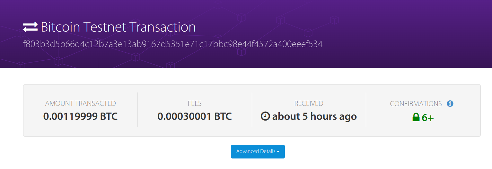
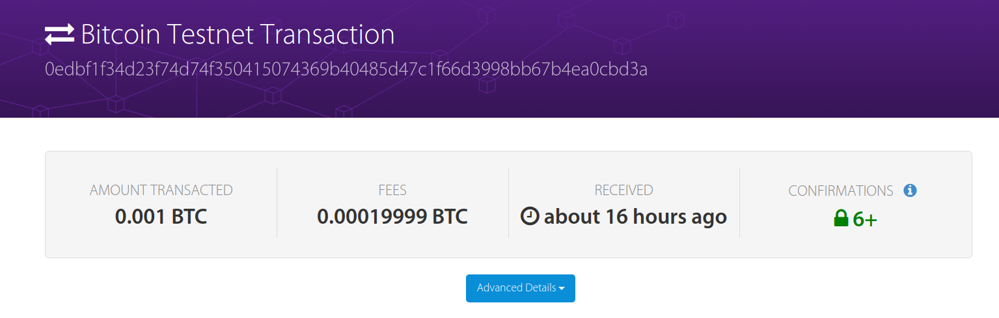

# lab3 
郭坤昌 2012522 计算机科学与技术

## 要求

1. 生成可通过以下线性方程组的解$(x,y)$​赎回的交易。请必要时调整（顺序减 1）你的 `StudentID` 后 3 位，使 `StudentID` 前 4
   位和 `StudentID` 后 3 位奇偶性相同
   $$
   \begin{align}
   \left\{\begin{matrix} 
     x+y & = studentID前4位 \\  
     x-y & = studentID后3位
   \end{matrix}\right. 
   \end{align}
   $$

2. 赎回交易。赎回脚本应尽可能小。也就是说，一个有效的 `scriptSig` 应该是简单地将两个整数 $x$ 和$y$ 发送到堆栈中。确保在 `scriptPubKey `中使用了 `OP_ADD` 和 `OP_SUB`

## 实验原理

使用学号2012522进行实验，则方程组为
$$
\begin{align}
\left\{\begin{matrix} 
  x+y & = 2012 \\  
  x-y & = 522
\end{matrix}\right. 
\end{align}
$$
线性方程组有整数解
$$
\begin{align}
\left\{\begin{matrix} 
  x & = 1267 \\  
  y & = 745
\end{matrix}\right. 
\end{align}
$$
加锁脚本和解锁脚本设计。解锁脚本应当为线性方程组的解。总共需要进行两次运算，因此首先复制$x$和$y$，通过`OP_2DUP`复制栈顶两个元素来实现。接着计算$x+y$，并与学号前4位进行比较。成功后计算$x-y$，并与学号后3位进行比较。若比较正确，则返回真。

设计解锁脚本为：

```Python
<x><y>
```

设计加锁脚本为：

```python
<OP_2DUP><OP_ADD><FIRST_HALF_OF_STUDENTID><OP_EQUALVERIFY><OP_SUB><REST_OF_STUDENTID><OP_EQUAL>
```

## 代码修改及实验结果

- 修改`ex3a.py`，使用第7份分币，设置相应交易`txid`和加锁量

```python
amount_to_send = 0.0012
txid_to_spend = ('cc8fb122460f9f4cd88cd4f3b5f149c07421da36835e55dea30e8162b1e68be3')
utxo_index = 7
```

- 加锁脚本：

```python
ex3a_txout_scriptPubKey = [OP_2DUP,OP_ADD,2012,OP_EQUALVERIFY,OP_SUB,522,OP_EQUAL]
```

- 运行结果为：

```json
201 Created
{
  "tx": {
    "block_height": -1,
    "block_index": -1,
    "hash": "f803b3d5b66d4c12b7a3e13ab9167d5351e71c17bbc98e44f4572a400eeef534",
    "addresses": [
      "mzLaAohp6ihFnuwQdQFFnm5zZ8jgh4UokJ"
    ],
    "total": 119999,
    "fees": 30001,
    "size": 178,
    "vsize": 178,
    "preference": "high",
    "relayed_by": "2001:250:401:6561:8263:286f:f1cd:d167",
    "received": "2022-11-01T11:40:02.476443156Z",
    "ver": 1,
    "double_spend": false,
    "vin_sz": 1,
    "vout_sz": 1,
    "confirmations": 0,
    "inputs": [
      {
        "prev_hash": "cc8fb122460f9f4cd88cd4f3b5f149c07421da36835e55dea30e8162b1e68be3",
        "output_index": 7,
        "script": "48304502210083ed9bf632377e1074cd7c56215d370d6113ebb524defb1b90377ecf8f6e39bc0220502ec22a0e3713fbf94bd1880420d2e1a9fb04a9fdc156a8f8cc353d1f05294d012102db5f0ae1ef53d76bd78a4254ae87cf293175c197bf6270744b7a8e1fa7966804",
        "output_value": 150000,
        "sequence": 4294967295,
        "addresses": [
          "mzLaAohp6ihFnuwQdQFFnm5zZ8jgh4UokJ"
        ],
        "script_type": "pay-to-pubkey-hash",
        "age": 2349299
      }
    ],
    "outputs": [
      {
        "value": 119999,
        "script": "6e9302dc078894020a0287",
        "addresses": null,
        "script_type": "unknown"
      }
    ]
  }
}
```



- 修改`ex3b.py`，设置交易`txid`和赎回量

```python
amount_to_send = 0.001
txid_to_spend = 'f803b3d5b66d4c12b7a3e13ab9167d5351e71c17bbc98e44f4572a400eeef534'
utxo_index = 0
```

- 解锁脚本：

```python
txin_scriptSig = [1267,745]
```

- 运行结果为：

```json
201 Created
{
  "tx": {
    "block_height": -1,
    "block_index": -1,
    "hash": "0edbf1f34d23f74d74f350415074369b40485d47c1f66d3998bb67b4ea0cbd3a",
    "addresses": [
      "mv4rnyY3Su5gjcDNzbMLKBQkBicCtHUtFB"
    ],
    "total": 100000,
    "fees": 19999,
    "size": 91,
    "vsize": 91,
    "preference": "high",
    "relayed_by": "2001:250:401:6561:67b7:1b60:9416:3f53",
    "received": "2022-11-01T16:20:05.330067861Z",
    "ver": 1,
    "double_spend": false,
    "vin_sz": 1,
    "vout_sz": 1,
    "confirmations": 0,
    "inputs": [
      {
        "prev_hash": "f803b3d5b66d4c12b7a3e13ab9167d5351e71c17bbc98e44f4572a400eeef534",
        "output_index": 0,
        "script": "02f30402e902",
        "output_value": 119999,
        "sequence": 4294967295,
        "script_type": "unknown",
        "age": 2401098
      }
    ],
    "outputs": [
      {
        "value": 100000,
        "script": "76a9149f9a7abd600c0caa03983a77c8c3df8e062cb2fa88ac",
        "addresses": [
          "mv4rnyY3Su5gjcDNzbMLKBQkBicCtHUtFB"
        ],
        "script_type": "pay-to-pubkey-hash"
      }
    ]
  }
}
```


