# Lab4 跨链原子交易

郭坤昌 2012522 计算机科学与技术

## 前期准备

1. 为 Alice 和 Bob 创建 BTC testnet 密钥。你可以用 keygen.py 生成密钥，把它填入
   keys.py 中合适的地方。

Alice  BTC testnet 私钥和地址：

```json
Private key: cSX3H7ZTGKSgBmWsuUSFtKobUDaKzMMXqzhzHeD98qpi1qM4rtUf
Address: mfiqoZPUQTrNpSHCCMW5K7tRpZ6QDDEsLe
```

Bob  BTC testnet 私钥和地址：

```json
Private key: cSoUGtb4DFNCZ5BRg3m4BWuv4U8tc19nW8V8Kwy73SWXnfjsR4Nc
Address: miQKwKQ1TwJ7uxaRj7U1aB9hrruTNQzD4F
```

2. 2 在Project1 中相同的 coinfaucet 上，https://coinfaucet.eu/en/btc-testnet/，为 Alice的 BTC 地址领取测试币。

为 Alice 的 BTC 地址领取测试币：

```json
tx: 29ebbaf33f4eb737e2592b39ef8348ddd9b31a17be7f333c03ee7252677d88c4
bitcoin: 0.03724932
```


确认的结果：


3. 1 在 Blockcypher 注册帐户以获取 API token：https://accounts.blockcypher.com/。

在 Blockcypher 领取 API token：

```json
token: 8acebf7dcf554bc2930bf01f1ec516f0
```


3. 2为 Alice 和 Bob 创建 BCY testnet 密钥并填入 keys.py.

   curl -X POST https://api.blockcypher.com/v1/bcy/test/addrs?token=8acebf7dcf554bc2930bf01f1ec516f0

为Alice创建 BCY testnet 密钥：

```json
{
  "private": "30d71b25d368dbe532c30063cc38d59e7f1f10fcafbc8c263e414072877d62b2",
  "public": "027eceaaf3478800216099ad300b79f1e0da56f0669760e105b43a9b7a9952b5ea",
  "address": "C2RT1LaD9EH1xdaJqtaoRoAMvxKYJQVNKD",
  "wif": "BpxyCqxbr1ixqDkjMpeRuqn5diHP1Kai9bMYMXEDabcb7fCSx6rK"
}
```

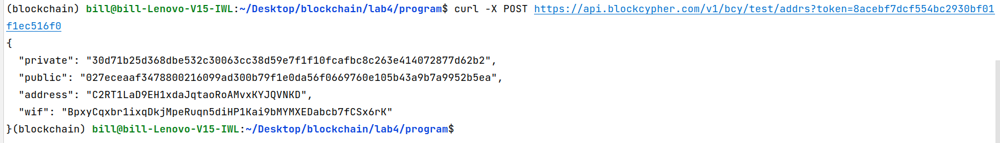

为 Bob 创建 BCY testnet 密钥：

```json
{
  "private": "6be882f8746c8ea3bbe9dc15d2c694fd8b75d433c6265dd70558e165849a7200",
  "public": "0303a04978f9c2d45754c7b9fe7e68f8de8d0636327c62e083ff4edab89e529e2b",
  "address": "C3Te5ctMDdNAbDyVUcDxWyNPqhrRKnoPJ3",
  "wif": "BrwnnrXuAX1uFwJTgYUfsKKJ6g2trrBahAHmkNoH8d2Gp4URtPSF"
}
```


3. 3在 Blockcypher 测试网（BCY）上为 Bob 的 BCY 地址领取测试币。

   curl -d ’{"address":"C3Te5ctMDdNAbDyVUcDxWyNPqhrRKnoPJ3", "amount": 1000000}’
   https://api.blockcypher.com/v1/bcy/test/faucet?token=8acebf7dcf554bc2930bf01f1ec516f0

```json
{
  "tx_ref": "3bfd0066036316bb2c88ff4c9346acd236f4254d70d43b574406422fcc4e0efd"
}
```

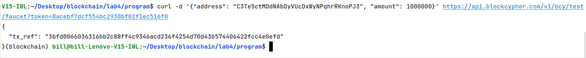

查询得到确认结果：


4. 使用 split_test_coins.py（填写文件中的相关字段）划分领取的币。

划分Alice 在 BTC 地址领取到的币

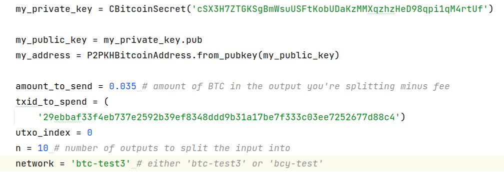

输出为

```json
201 Created
{
  "tx": {
    "block_height": -1,
    "block_index": -1,
    "hash": "783f4016bee7afdd479902e15b031a02077eb7a772293d731352e0bc4d5197e1",
    "addresses": [
      "mfiqoZPUQTrNpSHCCMW5K7tRpZ6QDDEsLe"
    ],
    "total": 3500000,
    "fees": 224932,
    "size": 498,
    "vsize": 498,
    "preference": "high",
    "relayed_by": "2001:250:401:6561:64cc:4fde:81b0:5543",
    "received": "2022-11-26T09:36:26.477039933Z",
    "ver": 1,
    "double_spend": false,
    "vin_sz": 1,
    "vout_sz": 10,
    "confirmations": 0,
    "inputs": [
      {
        "prev_hash": "29ebbaf33f4eb737e2592b39ef8348ddd9b31a17be7f333c03ee7252677d88c4",
        "output_index": 0,
        "script": "483045022100811925859b1a7955e46337136ce5d0766a10e4749dc2a7b55ef5d44f7735e9a502204ab47566dfb19f47f9f1df2e82d65eabe052c8ee54e5a3c281c66885f5bc8a4e0121033c562727bb2136198d74e25b13c0966a8b109c8dd42dcf9d150dd66b34140e3a",
        "output_value": 3724932,
        "sequence": 4294967295,
        "addresses": [
          "mfiqoZPUQTrNpSHCCMW5K7tRpZ6QDDEsLe"
        ],
        "script_type": "pay-to-pubkey-hash",
        "age": 2408351
      }
    ],
    "outputs": [
      {
        "value": 350000,
        "script": "76a914023f92a8a3f687e082b5e6c8e072fdbe0411620b88ac",
        "addresses": [
          "mfiqoZPUQTrNpSHCCMW5K7tRpZ6QDDEsLe"
        ],
        "script_type": "pay-to-pubkey-hash"
      },
      {
        "value": 350000,
        "script": "76a914023f92a8a3f687e082b5e6c8e072fdbe0411620b88ac",
        "addresses": [
          "mfiqoZPUQTrNpSHCCMW5K7tRpZ6QDDEsLe"
        ],
        "script_type": "pay-to-pubkey-hash"
      },
      {
        "value": 350000,
        "script": "76a914023f92a8a3f687e082b5e6c8e072fdbe0411620b88ac",
        "addresses": [
          "mfiqoZPUQTrNpSHCCMW5K7tRpZ6QDDEsLe"
        ],
        "script_type": "pay-to-pubkey-hash"
      },
      {
        "value": 350000,
        "script": "76a914023f92a8a3f687e082b5e6c8e072fdbe0411620b88ac",
        "addresses": [
          "mfiqoZPUQTrNpSHCCMW5K7tRpZ6QDDEsLe"
        ],
        "script_type": "pay-to-pubkey-hash"
      },
      {
        "value": 350000,
        "script": "76a914023f92a8a3f687e082b5e6c8e072fdbe0411620b88ac",
        "addresses": [
          "mfiqoZPUQTrNpSHCCMW5K7tRpZ6QDDEsLe"
        ],
        "script_type": "pay-to-pubkey-hash"
      },
      {
        "value": 350000,
        "script": "76a914023f92a8a3f687e082b5e6c8e072fdbe0411620b88ac",
        "addresses": [
          "mfiqoZPUQTrNpSHCCMW5K7tRpZ6QDDEsLe"
        ],
        "script_type": "pay-to-pubkey-hash"
      },
      {
        "value": 350000,
        "script": "76a914023f92a8a3f687e082b5e6c8e072fdbe0411620b88ac",
        "addresses": [
          "mfiqoZPUQTrNpSHCCMW5K7tRpZ6QDDEsLe"
        ],
        "script_type": "pay-to-pubkey-hash"
      },
      {
        "value": 350000,
        "script": "76a914023f92a8a3f687e082b5e6c8e072fdbe0411620b88ac",
        "addresses": [
          "mfiqoZPUQTrNpSHCCMW5K7tRpZ6QDDEsLe"
        ],
        "script_type": "pay-to-pubkey-hash"
      },
      {
        "value": 350000,
        "script": "76a914023f92a8a3f687e082b5e6c8e072fdbe0411620b88ac",
        "addresses": [
          "mfiqoZPUQTrNpSHCCMW5K7tRpZ6QDDEsLe"
        ],
        "script_type": "pay-to-pubkey-hash"
      },
      {
        "value": 350000,
        "script": "76a914023f92a8a3f687e082b5e6c8e072fdbe0411620b88ac",
        "addresses": [
          "mfiqoZPUQTrNpSHCCMW5K7tRpZ6QDDEsLe"
        ],
        "script_type": "pay-to-pubkey-hash"
      }
    ]
  }
}
```

确认结果

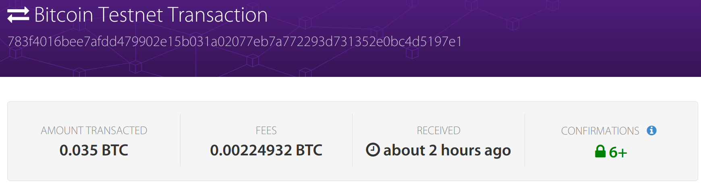

划分Bob 在 BCY 地址领取到的币

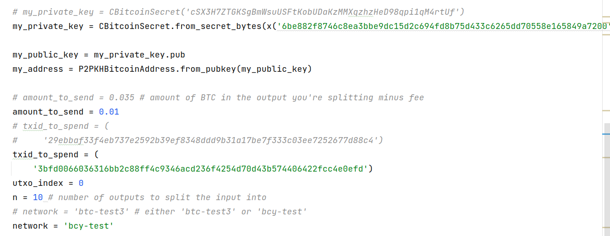

> 在填写Bob私钥时需要使用字节形式的。BCY给出的私钥不是64位编码，因此使用函数`x()`将其私钥转为字节，通过`from_secret_bytes()`导入

输出为

```json
201 Created
{
  "tx": {
    "block_height": -1,
    "block_index": -1,
    "hash": "8d8c4595ffc35e468541f6b4233eaf340cdd3574b8fa2bbaa71ed70ac542bc0a",
    "addresses": [
      "C3Te5ctMDdNAbDyVUcDxWyNPqhrRKnoPJ3"
    ],
    "total": 1000000,
    "fees": 0,
    "size": 498,
    "vsize": 498,
    "preference": "low",
    "relayed_by": "2001:250:401:6561:64cc:4fde:81b0:5543",
    "received": "2022-11-26T11:21:38.227295006Z",
    "ver": 1,
    "double_spend": false,
    "vin_sz": 1,
    "vout_sz": 10,
    "confirmations": 0,
    "inputs": [
      {
        "prev_hash": "3bfd0066036316bb2c88ff4c9346acd236f4254d70d43b574406422fcc4e0efd",
        "output_index": 0,
        "script": "483045022100c7aafe3148106bbc8170c3de8e2fbf506c5f866bd8ad52e4e6f0810f8e04c1aa02202d1d7cecc09d7351ee5384aa5ac2f73e73832d20c3a45455349f5a5543211e4f01210303a04978f9c2d45754c7b9fe7e68f8de8d0636327c62e083ff4edab89e529e2b",
        "output_value": 1000000,
        "sequence": 4294967295,
        "addresses": [
          "C3Te5ctMDdNAbDyVUcDxWyNPqhrRKnoPJ3"
        ],
        "script_type": "pay-to-pubkey-hash",
        "age": 556013
      }
    ],
    "outputs": [
      {
        "value": 100000,
        "script": "76a914715a44e68effa79eb6e25d0b0d06f12bfdc67a9788ac",
        "addresses": [
          "C3Te5ctMDdNAbDyVUcDxWyNPqhrRKnoPJ3"
        ],
        "script_type": "pay-to-pubkey-hash"
      },
      {
        "value": 100000,
        "script": "76a914715a44e68effa79eb6e25d0b0d06f12bfdc67a9788ac",
        "addresses": [
          "C3Te5ctMDdNAbDyVUcDxWyNPqhrRKnoPJ3"
        ],
        "script_type": "pay-to-pubkey-hash"
      },
      {
        "value": 100000,
        "script": "76a914715a44e68effa79eb6e25d0b0d06f12bfdc67a9788ac",
        "addresses": [
          "C3Te5ctMDdNAbDyVUcDxWyNPqhrRKnoPJ3"
        ],
        "script_type": "pay-to-pubkey-hash"
      },
      {
        "value": 100000,
        "script": "76a914715a44e68effa79eb6e25d0b0d06f12bfdc67a9788ac",
        "addresses": [
          "C3Te5ctMDdNAbDyVUcDxWyNPqhrRKnoPJ3"
        ],
        "script_type": "pay-to-pubkey-hash"
      },
      {
        "value": 100000,
        "script": "76a914715a44e68effa79eb6e25d0b0d06f12bfdc67a9788ac",
        "addresses": [
          "C3Te5ctMDdNAbDyVUcDxWyNPqhrRKnoPJ3"
        ],
        "script_type": "pay-to-pubkey-hash"
      },
      {
        "value": 100000,
        "script": "76a914715a44e68effa79eb6e25d0b0d06f12bfdc67a9788ac",
        "addresses": [
          "C3Te5ctMDdNAbDyVUcDxWyNPqhrRKnoPJ3"
        ],
        "script_type": "pay-to-pubkey-hash"
      },000
      {
        "value": 100000,
        "script": "76a914715a44e68effa79eb6e25d0b0d06f12bfdc67a9788ac",
        "addresses": [
          "C3Te5ctMDdNAbDyVUcDxWyNPqhrRKnoPJ3"
        ],
        "script_type": "pay-to-pubkey-hash"
      },
      {
        "value": 100000,
        "script": "76a914715a44e68effa79eb6e25d0b0d06f12bfdc67a9788ac",
        "addresses": [
          "C3Te5ctMDdNAbDyVUcDxWyNPqhrRKnoPJ3"
        ],
        "script_type": "pay-to-pubkey-hash"
      },
      {
        "value": 100000,
        "script": "76a914715a44e68effa79eb6e25d0b0d06f12bfdc67a9788ac",
        "addresses": [
          "C3Te5ctMDdNAbDyVUcDxWyNPqhrRKnoPJ3"
        ],
        "script_type": "pay-to-pubkey-hash"
      },
      {
        "value": 100000,
        "script": "76a914715a44e68effa79eb6e25d0b0d06f12bfdc67a9788ac",
        "addresses": [
          "C3Te5ctMDdNAbDyVUcDxWyNPqhrRKnoPJ3"
        ],
        "script_type": "pay-to-pubkey-hash"
      }
    ]
  }
}
```

验证结果


5. 填写 swap.py.

查询BTC区块链高度

BTC 高度查询地址：https://live.blockcypher.com/btc-testnet/

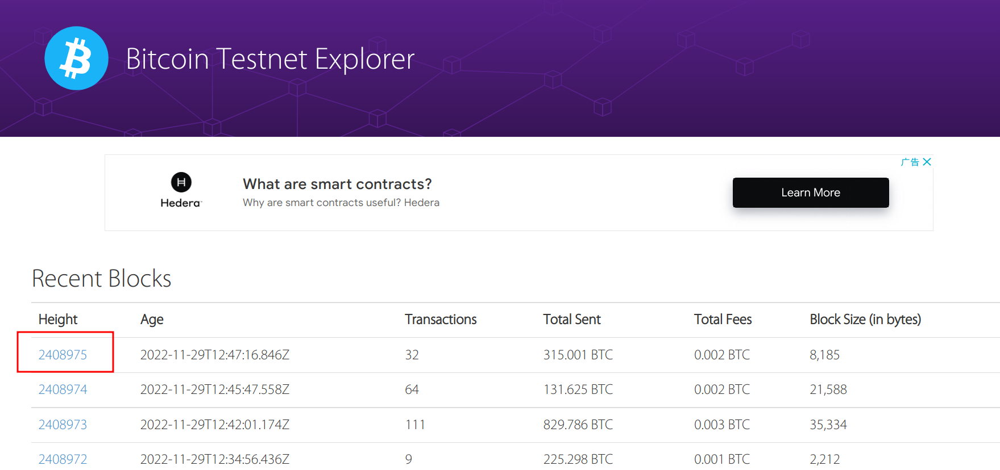

查询BCY区块链高度

BCY 区块高度查询地址：https://live.blockcypher.com/bcy/


5. 阅 读 swap.py, alice.py 和 bob.py ，以 及 https://en.bitcoin.it/wiki/Atomic_cross-chain_trading 中的伪代码，完善 swap_scripts.py 中的脚本。

## 设计文档

### coinExchangeScript工作原理

`coinExchangeScript`是对交换交易还是返还交易的确认，对应如下两种情况：

1. 对交换交易的确认：设计为需要收款方的签名和秘密可赎回，对应于`coinExchangeScriptSig1`。Bob对Alice交换交易的赎回需要秘密和自己的签名，而Alice赎回Bob的交换交易时只需要自己的签名，因此为了简便，这里在赎回交换交易时，均对自己（收款方）的签名和秘密进行确认。

```python
def coinExchangeScriptSig1(sig_recipient, secret):
    return [
        sig_recipient, 
        secret
    ]
```

2. 对返还交易的确认：设计为需要付款方的签名，对应于`coinExchangeScriptSig2`。

```python
def coinExchangeScriptSig2(sig_sender, sig_recipient):
    return [
        sig_sender
    ]
```

因此，在确认时，首先将栈顶元素与$H(x)$进行比较，若相等，则为秘密，进入第一种情况的进一步确认；否则进一步确认是否为第二种情况。这样，`coinExchangeScript`实现如下：

```python
def coinExchangeScript(public_key_sender, public_key_recipient, hash_of_secret):
    return [
        OP_DUP,                 # 复制栈顶元素
        OP_HASH160,             # 对栈顶元素进行hash160
        hash_of_secret,         # 将秘密的哈希压入栈顶
        OP_EQUAL,               # 比较是与秘密相等
        OP_IF,                  # 如果为秘密
        OP_DROP,                # 弹出栈顶多余的元素
        public_key_recipient,	# 接将收款方公钥压栈，验证收款方的签名
        OP_ELSE,                # 否则，验证是否为返还交易
        public_key_sender,      # 将付款方的公钥压入栈顶 
        OP_ENDIF,               # 结束分支判断
        OP_CHECKSIG             # 验证签名
    ]
```

| 步骤 | 操作                 | 解释                                                         |
| ---- | -------------------- | ------------------------------------------------------------ |
| 1    | OP_DUP               | 复制栈顶元素                                                 |
| 2    | OP_HASH160           | 对栈顶元素执行Hash160计算，结果记为$H(top)$                  |
| 3    | hash_of_secret       | 将$H(x)$压栈                                                 |
| 4    | OP_EQUAL             | 比较$H(top)$与$H(x)$是否相等。若相等则原栈顶元素为$x$，OP_EQUAL返回1，对应于对交换交易的解锁，接下来执行OP_DROP弹出多余$x$，将收款方公钥压栈，验证收款方签名；否则OP_EQUAL返回0，对应于对返还交易的解锁，将付款方公钥压栈，验证付款方签名。 |
| 5    | OP_IF                | 当栈顶元素不为OP_FALSE时，执行接下来的语句；否则执行OP_ELSE后的语句 |
| 6    | OP_DROP              | 弹出多余的$x$                                                |
| 7    | public_key_recipient | 将收款方公钥压栈                                             |
| 8    | OP_ELSE              | OP_EQUAL返回0，执行接下来的语句                              |
| 9    | public_key_sender    | 将付款方公钥压栈                                             |
| 10   | OP_ENDIF             | 必须应用此OP_CODE，以结束IF语句                              |
| 11   | OP_CHECKSIG          | 验证压栈的公钥是否符合签名。若验证收款方成功，则交换交易成功；若验证付款方成功，则收款交易成功；否则，签名错误，交易不成功。 |

### 以 Alice 用 coinExchangeScript 向 Bob 发送硬币为例：如果 Bob 不把钱赎回来，Alice 为什么总能拿回她的钱？为什么不能用简单的 `1/2 multisig` 来解决这个问题？

若Bob没有在Alice创建的自动返还比特币交易上签名，则Alice不能获得Bob的签名，并在解锁Bob的交换交易后告知秘密，这样Bob就不能赎回Alice创建的交换交易，当超过48小时后，Alice将会自动拿回她的钱。

若使用 `1/2 multisig`，则可以使用任意一方的签名将交易赎回，可能出现一方将两份UTXO均赎回，不能保证在没有互信和第三方的情况下交换一定成功。

### Alice和Bob创建的交易内容和先后次序，以及背后设计的原理

该实验中原子交换的原理简述：围绕只有Alice知道的秘密$x$进行，只广播$H(x)$。如果$x$被透露，那么他们都能赎回对方发送来的货币；如果$x$没有被透露，那么他们都能赎回自己发送的货币，而不需要对方的帮助。

交易过程为：

| 步骤 | 详细                                                         |
| ---- | ------------------------------------------------------------ |
| 1    | Alice根据秘密，使用哈希加密，生成tx1：支付$w$ 比特币（BTC-test） 给Bob的公钥，如果$x$已知并由Bob签名，或Alice和Bob共同签名 |
| 2    | Alice创建tx2，：从tx1支付$w$比特币到Alice的公钥，并在未来48小时内锁定，由Alice签名。若Bob不赎回tx1，这是Alice可以自动将比特币发回的交易 |
| 3    | Alice发送tx2给Bob                                            |
| 4    | Bob对tx2进行签名并返回给Alice                                |
| 5    | Alice获得Bob的签名，向网络广播tx1                            |
| 6    | Bob创建tx3：若$H(x)$的$x$已知并由Alice签名，或由Alice和Bob共同签名，则将$v$ 比特币（BCY）支付给Alice的公钥 |
| 7    | Bob创建tx4：从tx3支付$v$比特币到Bob的公钥，并在未来24小时内锁定，由Bob签名。若Alice不赎回tx3，这是Bob可以自动将比特币发回的交易 |
| 8    | Bob发送tx4给Alice                                            |
| 9    | Alice对tx4签名并返回给Bob                                    |
| 10   | Bob获得Alice的签名，向网络广播tx3                            |
| 11   | Alice赎回tx3，同时将该赎回交易广播，$x$被Bob得知             |
| 12   | Bob使用$x$和自己的签名赎回tx1，该赎回交易被广播              |

交易过程图示如下：（图源：[区块链世界的圣杯----原子互换（Atomic Swaps）技术](https://www.jianshu.com/p/242ef75e18be)）


### 成功跨链原子交换中，资金的流转

这里通过详细步骤进行说明

| 步骤 | 详细                                                         | 资金流转                                             |
| ---- | ------------------------------------------------------------ | ---------------------------------------------------- |
| 1    | Alice根据秘密，使用哈希加密，生成tx1：支付$w$ 比特币（BTC-test） 给Bob的公钥，如果$x$已知并由Bob签名，或Alice和Bob共同签名 | tx1含有的$w$个比特币属于Alice                        |
| 2    | Alice创建tx2，：从tx1支付$w$比特币到Alice的公钥，并在未来48小时内锁定，由Alice签名。若Bob不赎回tx1，这是Alice可以自动将比特币发回的交易 |                                                      |
| 3    | Alice发送tx2给Bob                                            |                                                      |
| 4    | Bob对tx2进行签名并返回给Alice                                |                                                      |
| 5    | Alice获得Bob的签名，向网络广播tx1                            |                                                      |
| 6    | Bob创建tx3：若$H(x)$的$x$已知并由Alice签名，或由Alice和Bob共同签名，则将$v$ 比特币（BCY）支付给Alice的公钥 | tx3含有的$v$个比特币属于Bob                          |
| 7    | Bob创建tx4：从tx3支付$v$比特币到Bob的公钥，并在未来24小时内锁定，由Bob签名。若Alice不赎回tx3，这是Bob可以自动将比特币发回的交易 |                                                      |
| 8    | Bob发送tx4给Alice                                            |                                                      |
| 9    | Alice对tx4签名并返回给Bob                                    |                                                      |
| 10   | Bob获得Alice的签名，向网络广播tx3                            |                                                      |
| 11   | Alice赎回tx3，同时将该赎回交易广播，$x$被Bob得知             | Alice赎回tx3中的比特币，此时其中$v$个比特币属于Alice |
| 12   | Bob使用$x$和自己的签名赎回tx1，该赎回交易被广播              | Bob赎回tx1中的比特币，此时其中$w$个比特币属于Bob     |

## 实验结果

### 不赎回不广播

Alice没有对Bob的交换交易进行赎回，因此Bob的返还交易在锁定时间结束后将比特币退回，之后因为Bob没有赎回Alice的交换交易，Alice的返还交易在锁定时间之后将比特币退回。如下为该情况的输出结果，符合流程

```json
Alice swap tx (BTC) created successfully!
Bob swap tx (BCY) created successfully!
Bob return coins (BCY) tx created successfully!
Alice return coins tx (BTC) created successfully!
```

### 赎回但不广播

Alice对Bob的交换交易进行赎回，并广播秘密，这样Bob也使用秘密和自己的签名将Alice的交换交易赎回，原子交换成功。如下输出符合流程。

```json
Alice swap tx (BTC) created successfully!
Bob swap tx (BCY) created successfully!
Alice redeem from swap tx (BCY) created successfully!
Bob redeem from swap tx (BTC) created successfully!
```

### 赎回且广播

- 完整输出结果


```json
Alice swap tx (BTC) created successfully!
201 Created
{
  "tx": {
    "block_height": -1,
    "block_index": -1,
    "hash": "2c1fa728e7632722fcca55acfc6689683ba0a0b761ddccf4e2f43accce0ee202",
    "addresses": [
      "mfiqoZPUQTrNpSHCCMW5K7tRpZ6QDDEsLe"
    ],
    "total": 340000,
    "fees": 10000,
    "size": 264,
    "vsize": 264,
    "preference": "low",
    "relayed_by": "2001:250:401:6561:76a7:112f:20a4:dbd1",
    "received": "2022-12-03T19:06:23.178389124Z",
    "ver": 1,
    "double_spend": false,
    "vin_sz": 1,
    "vout_sz": 1,
    "confirmations": 0,
    "inputs": [
      {
        "prev_hash": "783f4016bee7afdd479902e15b031a02077eb7a772293d731352e0bc4d5197e1",
        "output_index": 7,
        "script": "483045022100ca22d7114d3d39956849a1f136ed3b3392a5fdc43c3aa458afff294ca2902dbc02207630a6e05ba28ac121aeb44e4e82e896136c34ebe4a6ecba30ecb2e9e94f51820121033c562727bb2136198d74e25b13c0966a8b109c8dd42dcf9d150dd66b34140e3a",
        "output_value": 350000,
        "sequence": 4294967295,
        "addresses": [
          "mfiqoZPUQTrNpSHCCMW5K7tRpZ6QDDEsLe"
        ],
        "script_type": "pay-to-pubkey-hash",
        "age": 2408390
      }
    ],
    "outputs": [
      {
        "value": 340000,
        "script": "76a914853b775079232503df966e626618e1d388a9572087637521038526a58b8294738325a59824a38936b5dfdda760b301c6161cba81ed5bc701786721033c562727bb2136198d74e25b13c0966a8b109c8dd42dcf9d150dd66b34140e3a68ac",
        "addresses": null,
        "script_type": "unknown"
      }
    ]
  }
}
Bob swap tx (BCY) created successfully!
201 Created
{
  "tx": {
    "block_height": -1,
    "block_index": -1,
    "hash": "66150903a0b8d178b43c872517794e3fe8cb9b8046b04e3bc7a4e856cac686b1",
    "addresses": [
      "C3Te5ctMDdNAbDyVUcDxWyNPqhrRKnoPJ3"
    ],
    "total": 90000,
    "fees": 10000,
    "size": 263,
    "vsize": 263,
    "preference": "low",
    "relayed_by": "2001:250:401:6561:76a7:112f:20a4:dbd1",
    "received": "2022-12-03T19:06:24.592342785Z",
    "ver": 1,
    "double_spend": false,
    "vin_sz": 1,
    "vout_sz": 1,
    "confirmations": 0,
    "inputs": [
      {
        "prev_hash": "8d8c4595ffc35e468541f6b4233eaf340cdd3574b8fa2bbaa71ed70ac542bc0a",
        "output_index": 7,
        "script": "4730440220776107903e5820f99ccb107f03cf08be04ff3996698051e201a4a66d8af2b898022058c4d1a4861862ec190848a2916b8a704ff166e69d1bc89ef1672222c5a998b901210303a04978f9c2d45754c7b9fe7e68f8de8d0636327c62e083ff4edab89e529e2b",
        "output_value": 100000,
        "sequence": 4294967295,
        "addresses": [
          "C3Te5ctMDdNAbDyVUcDxWyNPqhrRKnoPJ3"
        ],
        "script_type": "pay-to-pubkey-hash",
        "age": 562168
      }
    ],
    "outputs": [
      {
        "value": 90000,
        "script": "76a914853b775079232503df966e626618e1d388a9572087637521027eceaaf3478800216099ad300b79f1e0da56f0669760e105b43a9b7a9952b5ea67210303a04978f9c2d45754c7b9fe7e68f8de8d0636327c62e083ff4edab89e529e2b68ac",
        "addresses": null,
        "script_type": "unknown"
      }
    ]
  }
}
Sleeping for 60 minutes to let transactions confirm...
Alice redeem from swap tx (BCY) created successfully!
201 Created
{
  "tx": {
    "block_height": -1,
    "block_index": -1,
    "hash": "8bd26b5f75ef67e5fe51dfec8b2079be1d72d6fccce15c7f591be7e9b1dc863b",
    "addresses": [
      "C2RT1LaD9EH1xdaJqtaoRoAMvxKYJQVNKD"
    ],
    "total": 80000,
    "fees": 10000,
    "size": 182,
    "vsize": 182,
    "preference": "low",
    "relayed_by": "2001:250:401:6561:76a7:112f:20a4:dbd1",
    "received": "2022-12-03T22:06:25.247080971Z",
    "ver": 1,
    "double_spend": false,
    "vin_sz": 1,
    "vout_sz": 1,
    "confirmations": 0,
    "inputs": [
      {
        "prev_hash": "66150903a0b8d178b43c872517794e3fe8cb9b8046b04e3bc7a4e856cac686b1",
        "output_index": 0,
        "script": "47304402204fa38c32dccc1ae9afbc7c95d534f83ff0be305a28079cb2c05522af990f7f2402205d02ed87c069086cea063eda090ae64214c441fc79ae9cbf5012563a52a8378b01187468697349734153656372657450617373776f7264313233",
        "output_value": 90000,
        "sequence": 4294967295,
        "script_type": "unknown",
        "age": 572650
      }
    ],
    "outputs": [
      {
        "value": 80000,
        "script": "76a91465f8114669e05d98b6320a04677ed2e19eba81bb88ac",
        "addresses": [
          "C2RT1LaD9EH1xdaJqtaoRoAMvxKYJQVNKD"
        ],
        "script_type": "pay-to-pubkey-hash"
      }
    ]
  }
}
Bob redeem from swap tx (BTC) created successfully!
201 Created
{
  "tx": {
    "block_height": -1,
    "block_index": -1,
    "hash": "6bc76bfd1796e62953057f1eabbc21ba445f81696d1187eb6602f410af3a5c55",
    "addresses": [
      "miQKwKQ1TwJ7uxaRj7U1aB9hrruTNQzD4F"
    ],
    "total": 330000,
    "fees": 10000,
    "size": 183,
    "vsize": 183,
    "preference": "low",
    "relayed_by": "2001:250:401:6561:76a7:112f:20a4:dbd1",
    "received": "2022-12-03T22:06:25.797106409Z",
    "ver": 1,
    "double_spend": false,
    "vin_sz": 1,
    "vout_sz": 1,
    "confirmations": 0,
    "inputs": [
      {
        "prev_hash": "2c1fa728e7632722fcca55acfc6689683ba0a0b761ddccf4e2f43accce0ee202",
        "output_index": 0,
        "script": "483045022100c623e3792b73ff9fad4511a958b79c119b497a2019b7d5c767421f842ca87be702201ee77769d010f3d95722afb00bfd8910c43eca91f643a3c74be4638af46598b701187468697349734153656372657450617373776f7264313233",
        "output_value": 340000,
        "sequence": 4294967295,
        "script_type": "unknown",
        "age": 2409652
      }
    ],
    "outputs": [
      {
        "value": 330000,
        "script": "76a9141fa7882789fa7699c326f7c863684673450758f688ac",
        "addresses": [
          "miQKwKQ1TwJ7uxaRj7U1aB9hrruTNQzD4F"
        ],
        "script_type": "pay-to-pubkey-hash"
      }
    ]
  }
}
```

- 截图

Bob对Alice创建的返还交易即tx2进行签名后，Alice广播交换交易即tx1，tx1的确认结果

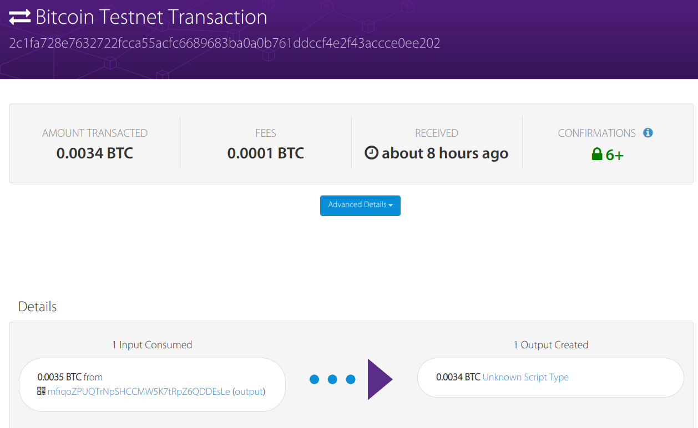

创建的交换交易即tx3，Alice对Bob创建的返还交易即tx4进行签名后，Bob广播交换交易即tx3，tx3的确认结果

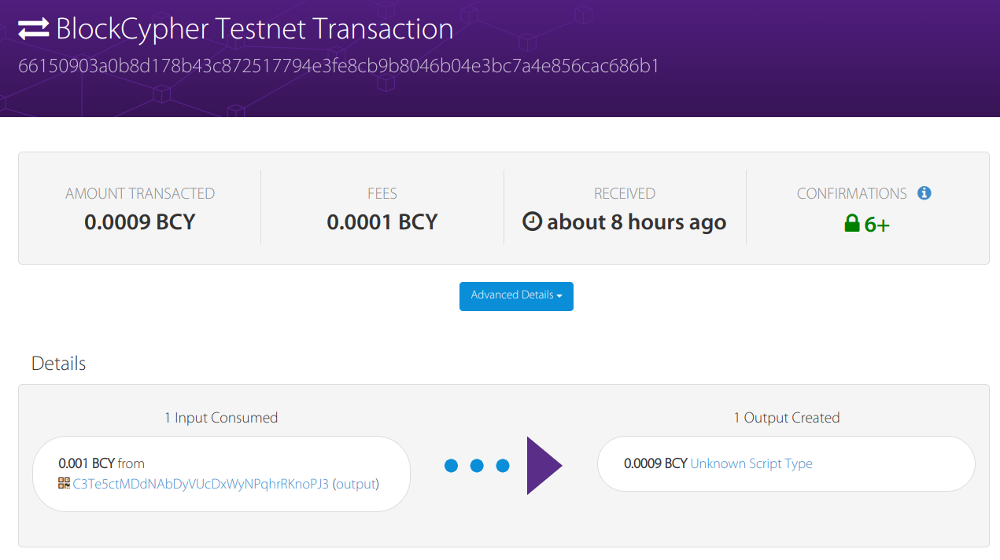

Alice赎回Bob创建的交换交易即tx3，该赎回交易的确认结果

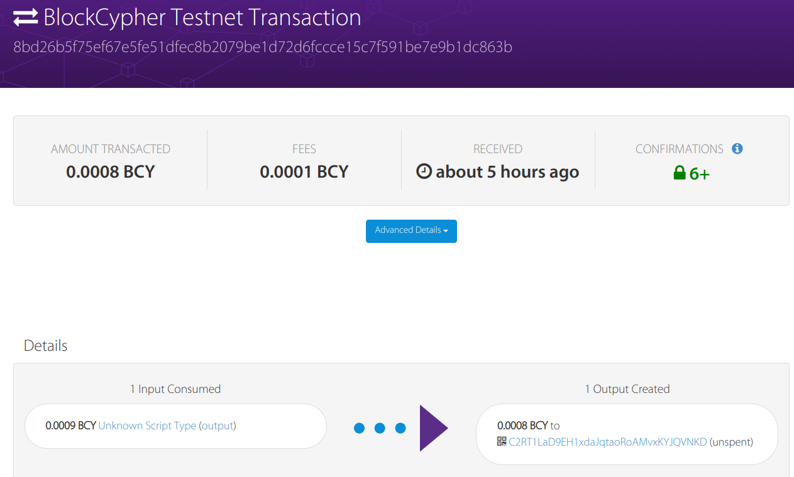

Bob赎回Alice创建的交换交易即tx1，该赎回交易的确认结果

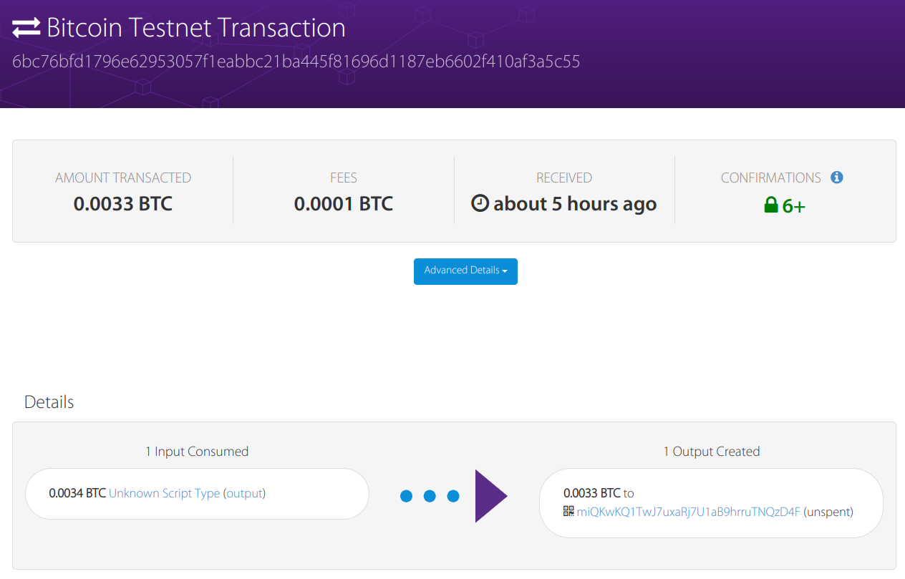

## 遇到的问题

### 赎回交易时遇到`misssing reference`

- 问题现象

```json
# tx3序列号
8c755151d9ae31c0d4e1dabe9156207176817d2f2a008268803a724f4c1b28c2

# 赎回tx3时报错
{"error": "Error validating transaction: Transaction dc8e0dd1d6f96d5a7d117a0c6a0381d88531a53a77c06975e3e98bde84a1ab90 orphcy/test/taned, missing reference c2281b4c4f723a806882002a2f7d817671205691bedae1d4c031aed95151758c."}
```

- 问题原因

在助教学长的指导下，得知发生该错误的原因是`b2x`函数得到的是大端序列，因此序列号对不上。注意到`missing reference`中的`txid`正是`tx3`对应序列号

- 问题解决

将获取`txid`的函数由大端转为小端，即将`b2x`函数修改为使用`b2lx`函数

```python
def b2x(b):
    """Convert bytes to a hex string"""
    return binascii.hexlify(b).decode('utf8')
    
def b2lx(b):
    """Convert bytes to a little-endian hex string

    Lets you show uint256's and uint160's the way the Satoshi codebase shows
    them.
    """
    return binascii.hexlify(b[::-1]).decode('utf8')
```

以`Alice.py`中的函数`return_coins_tx`为例，依次修改`Alice.py`和`Bob.py`中相应的调用位置

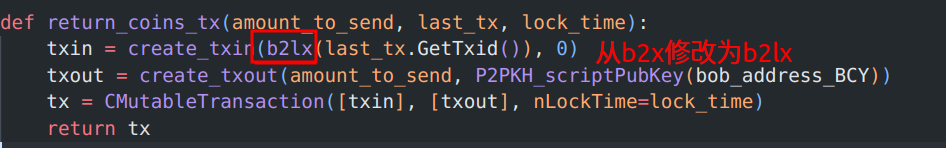
